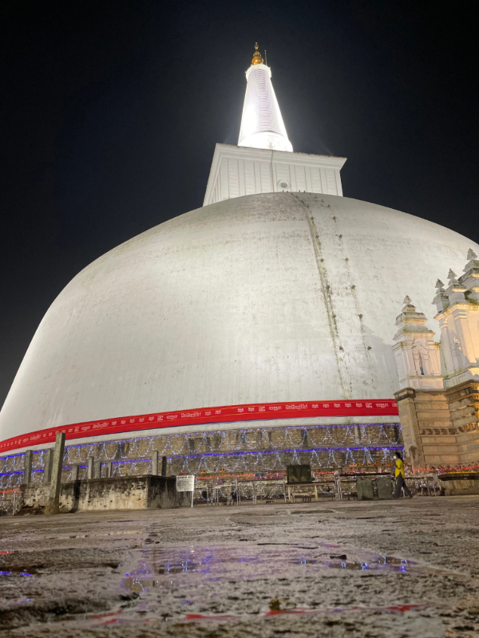
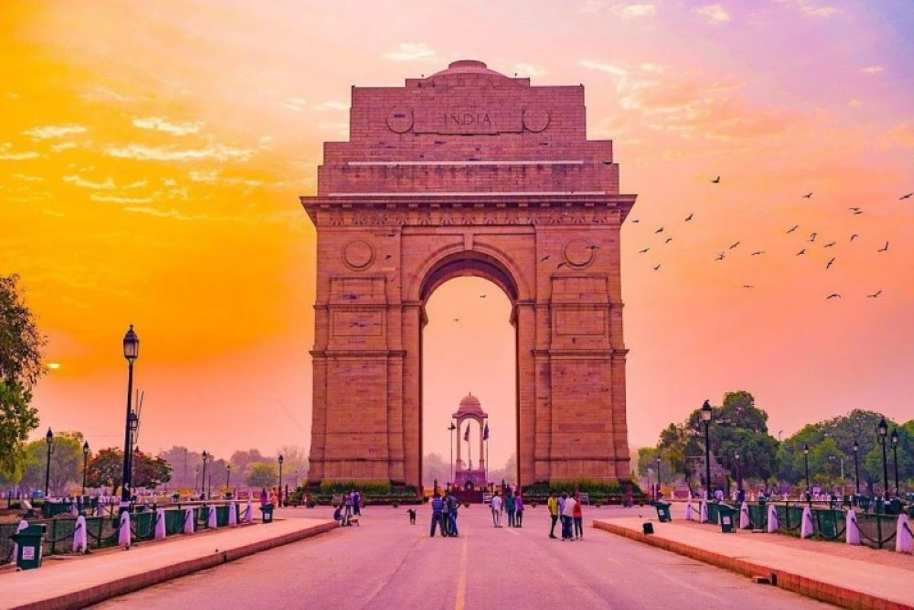
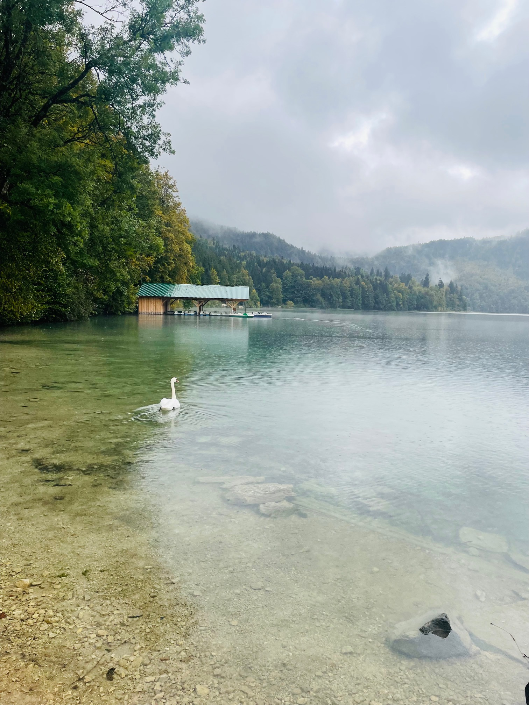
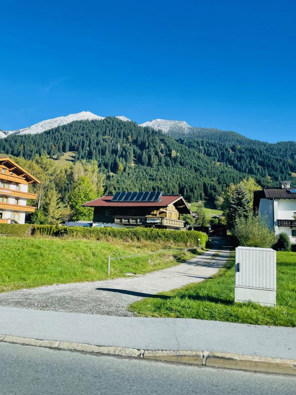
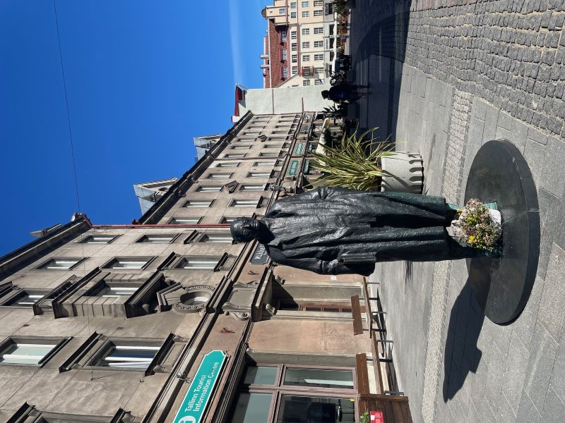
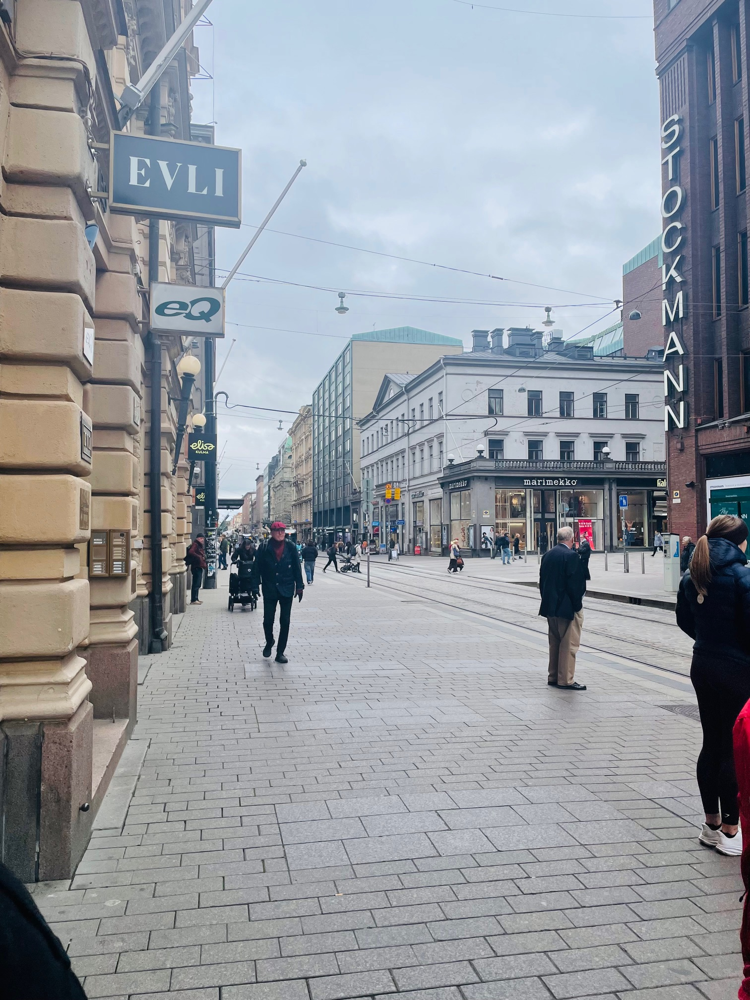

# Welcome to My Travel Adventures 🌍✈️❤️

## Favorite Destinations

### 1. **Anuradhapura, Sri Lanka**

"Anuradhapura, Sri Lanka: A timeless journey through ancient ruins, sacred temples, and serene landscapes. Discover the heart of Sri Lanka's cultural heritage amidst towering stupas and centuries-old banyan trees."

- **Must-see**: Sacred Bodhi Tree (Jaya Sri Maha Bodhi) 🌳 
- **Best time to visit**: August 🏛️ for the vibrant Esala Perahera Festival

---

### 2. **New Delhi, India**

"Delhi, India: A vibrant fusion of history and modernity, where majestic monuments meet bustling markets and flavorful street food. Explore the rich cultural tapestry in the shadow of ancient forts and contemporary wonders."

- **Must-see**: Red Fort and Humayun's Tomb 🕌
- **Best time to visit**: October to March 🌸 for pleasant weather and festivals

---

### 3. **Munich, Germany**

"Germany: A land of fairy-tale castles, lush forests, and cosmopolitan cities, where centuries of history and innovation blend seamlessly. Experience world-class art, vibrant festivals, and picturesque landscapes."

- **Must-see**: Neuschwanstein Castle and the Black Forest 🏰🌲
- **Best time to visit**: May to September ☀️ for warm weather and outdoor festivals

---

### 4. **Lermoos, Austria**

"Austria: A picturesque haven of stunning alpine landscapes, charming villages, and rich musical heritage. Explore the majestic mountains, historic cities, and indulge in delicious pastries and coffee culture."

- **Must-see**: Schönbrunn Palace and Hallstatt 🏰🏞️
- **Best time to visit**: December for enchanting Christmas markets and winter sports! ❄️✨

---

### 5. **Tallinn, Estonia**

"Estonia: A captivating blend of medieval charm and modern innovation, where cobblestone streets wind through fairy-tale architecture. Discover a vibrant cultural scene, rich history, and stunning views of the Baltic Sea."

- **Must-see**: Tallinn Old Town and Toompea Castle 🏰🌟
- **Best time to visit**: June to August for lively festivals and pleasant weather! ☀️🌼

---

### 6. **Helsinki, Finland**

"Finland: A breathtaking realm of pristine nature, vibrant culture, and innovative design, where the Northern Lights dance across the night sky. Experience tranquil lakes, enchanting forests, and the warmth of Finnish sauna traditions."

- **Must-see**: Helsinki's Suomenlinna Fortress and Lapland's Santa Claus Village 🎅🏰
- **Best time to visit**: December for magical winter landscapes and festive Christmas markets! ❄️

---

## Travel Tips 🧳

- ✈️ Pack light and travel often.
- 🍽️ Try local food, always!
- 📸 Capture every moment, but live in the present.

---

### About Me

I am an avid traveler who loves exploring new places, meeting people, and enjoying different cultures. You can follow my journeys on [Instagram](https://instagram.com/travelvithhasi/).

---

### Contact

- **Tel**: +358 41 7270325 
- **Email**: [t3hiha00@students.oamk.fi](mailto:t3hiha00@students.oamk.fi)

---
&copy; 2024 Hasitha Hiththatiyage. All rights reserved.  
Follow me on [Instagram](https://instagram.com/travelvithhasi/) for more travel adventures!  
Check out my [GitHub](https://github.com/hasiya89) for other projects.
